# Coffee Finder 

## Project Overview

Coffee Finder is a front-end web application designed to help users discover coffee options through a simple interactive quiz. The website provides a clean, responsive interface and allows users to engage with content easily.

---

## Target Audience

* Coffee lovers looking for recommendations
* Casual users exploring drink options
* Mobile users needing a simple, responsive interface

---

## Features

* Interactive quiz for coffee selection
* Responsive design for mobile and desktop
* Clean and consistent UI styling
* Fast-loading static website

---

## Technologies Used

### Languages
- HTML5
- CSS3
- JavaScript

### Tools
- Git
- GitHub
- GitHub Pages
- Google Fonts
- Font Awesome

## User Stories

* As a user, I want to answer a quiz so I can get a coffee recommendation
* As a user, I want a simple layout so I can navigate easily
* As a mobile user, I want the site to work on my device

---

## UX Design

Wireframes were created to plan layout and structure before development.

Design decisions:

* Simple navigation for ease of use
* Large buttons for accessibility
* Clear text for readability

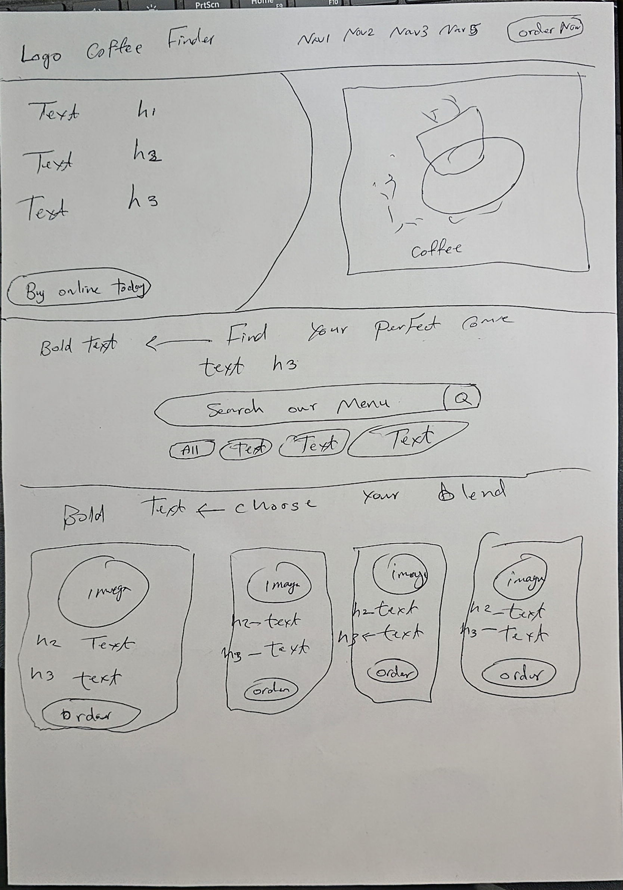

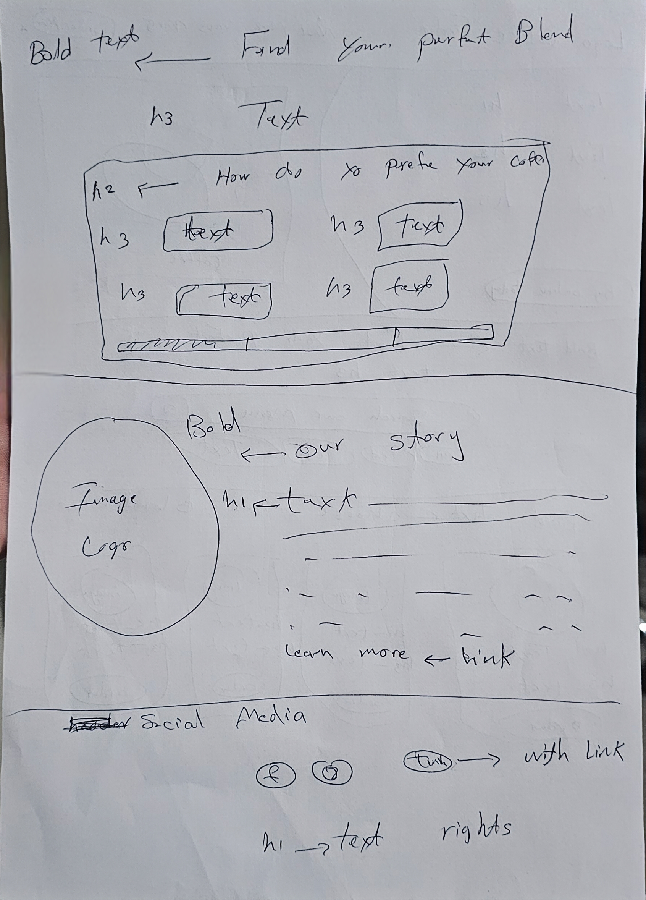

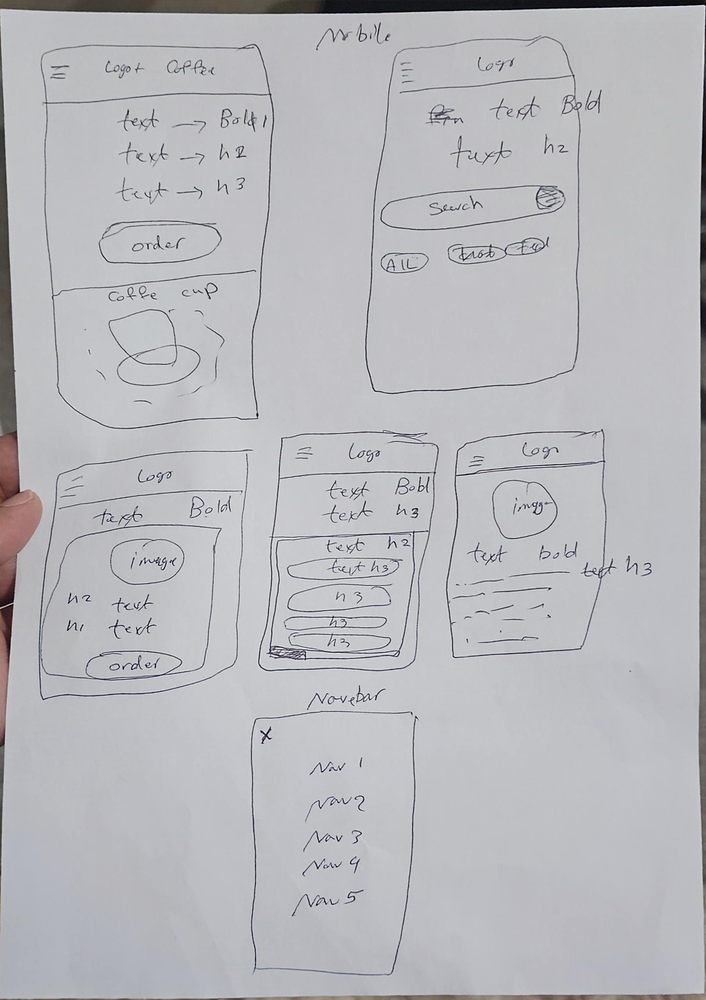

---

## Testing Methods

### Manual Testing

Manual testing was used throughout development by interacting directly with the website and checking that all features worked correctly.

Manual testing included:
- navigation testing
- responsive layout testing
- form validation testing
- button interaction testing
- product functionality testing

Manual testing is useful for identifying usability problems and checking the overall user experience of the website.

### Automated Testing

Automated testing tools were used to validate the code and identify syntax or validation errors automatically.

The following tools were used:
- W3C HTML Validator
- W3C CSS Validator

Automated testing is useful because it quickly identifies coding issues, validation errors, and problems with web standards compliance.

## Testing

| Test ID | Page | Feature Tested | Steps Taken | Expected Result | Actual Result | Pass/Fail |
|----------|------|----------------|-------------|-----------------|---------------|------------|
| T1 | Home | Navigation links | Clicked each navigation link in navbar | Correct pages open | All pages opened correctly | PASS |
| T2 | Home | Images display | Opened homepage and checked images | Images display correctly without stretching | Images displayed correctly | PASS |
| T3 | Home | Responsive layout | Resized browser to mobile/tablet sizes | Layout adjusts correctly | Layout adjusted correctly | PASS |
| T4 | Products | Product cards | Opened products page | Product cards display correctly | Product cards displayed correctly | PASS |
| T5 | Products | Add to cart links | Clicked add to cart buttons | Cart page opens correctly | Buttons worked correctly | PASS |
| T6 | Contact | Form validation | Submitted empty form | Validation message appears | Validation worked correctly | PASS |
| T7 | Contact | Required fields | Left required fields blank | Form prevents submission | Form prevented submission | PASS |
| T8 | Contact | Submit button | Submitted completed form | Form submits successfully | Form submitted correctly | PASS |
| T9 | All Pages | Mobile responsive | Tested on mobile screen size | Website remains usable | Website remained responsive on mobile | PASS |

## User Stories Testing Evidence

### User Story 1 – Clear Navigation

As a customer I want clear navigation so I can find website sections easily.

#### Evidence
The navigation bar remains visible across the website and correctly links to all sections including Home, Finder, Coffee, Quiz, and About.

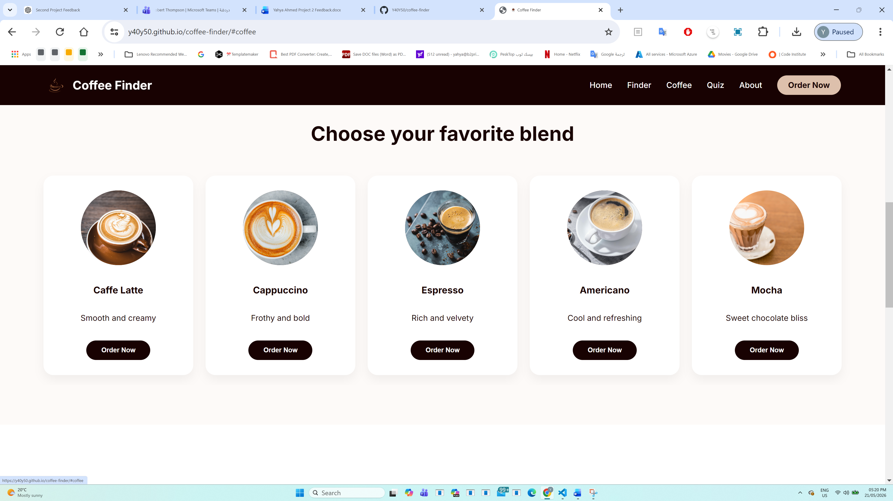
---

### User Story 2 – Browse Coffee Products
As a customer I want to browse coffee products so I can choose a product easily.

#### Evidence
Coffee products are displayed using responsive product cards with images, descriptions, and order buttons.

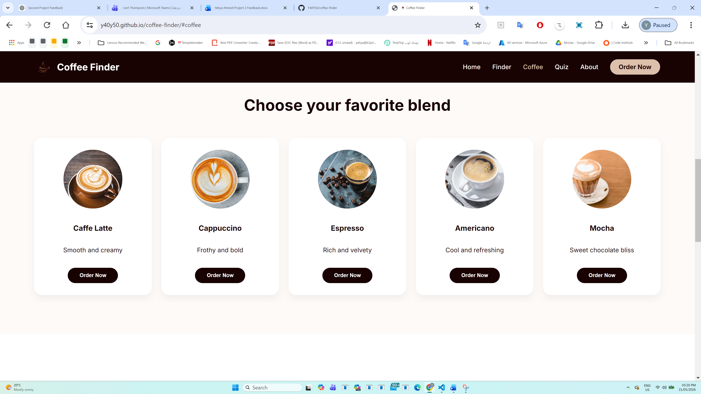
---

### User Story 3 – Interactive Quiz Functionality
As a user I want interactive features so the website feels engaging and responsive.

#### Evidence
The website includes an interactive coffee quiz where users can select options and receive feedback.

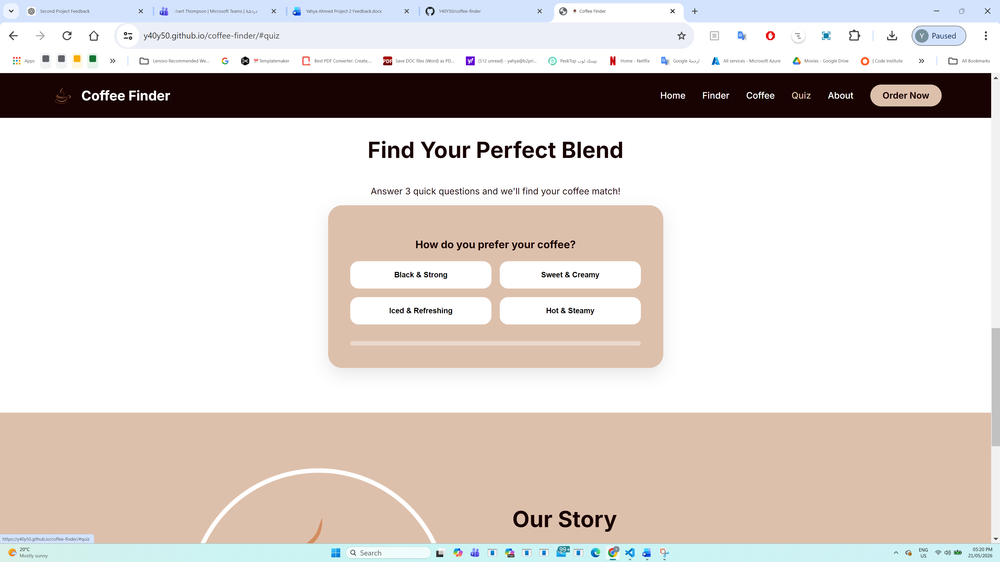
---

### User Story 4 – Search and Filter Functionality
As a user I want to search and filter products so I can quickly find suitable coffee options.

#### Evidence
The website includes a search bar and category filter buttons for improved usability.

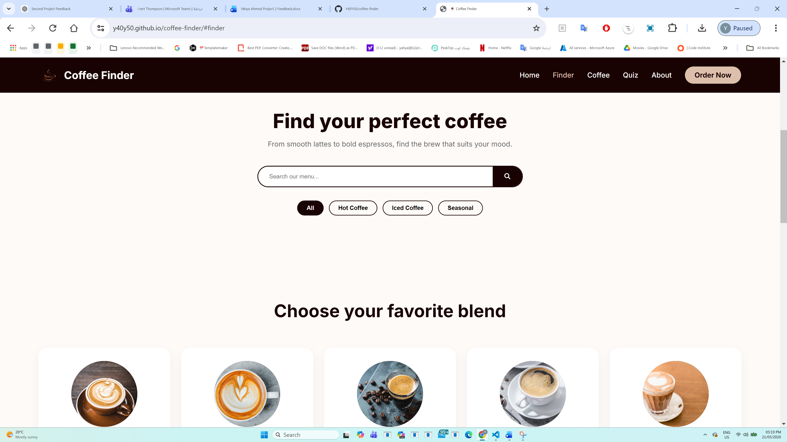
---

### User Story 5 – About Section and Brand Information
As a customer I want to learn about the brand and its story.

#### Evidence
The About section provides brand information and improves user engagement.

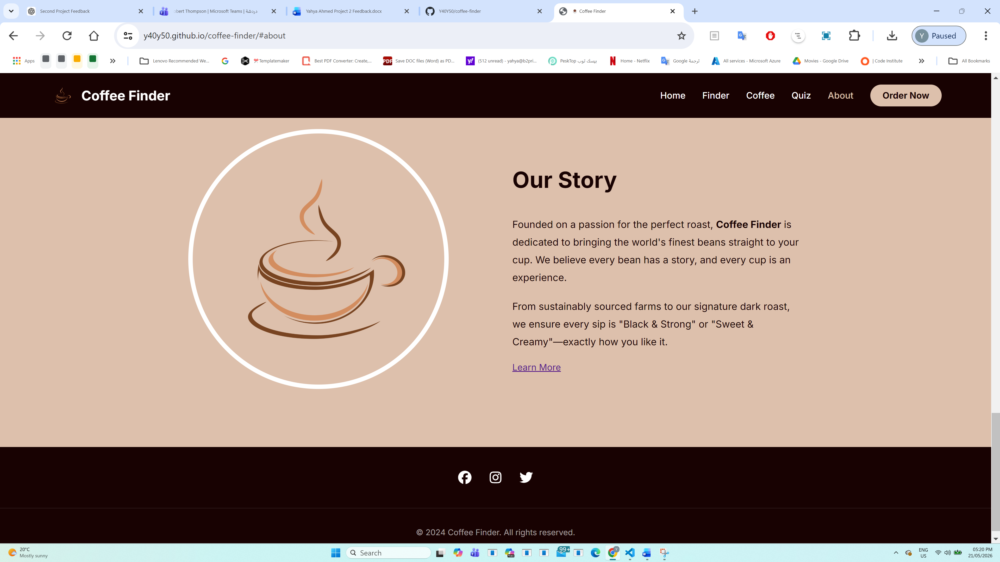
---

### User Story 6 – Responsive Mobile Design
As a user I want the website to work correctly on mobile devices.

#### Evidence
The website layout adjusts correctly on smaller screen sizes. Navigation, images, buttons, and text remain readable and usable on mobile devices.

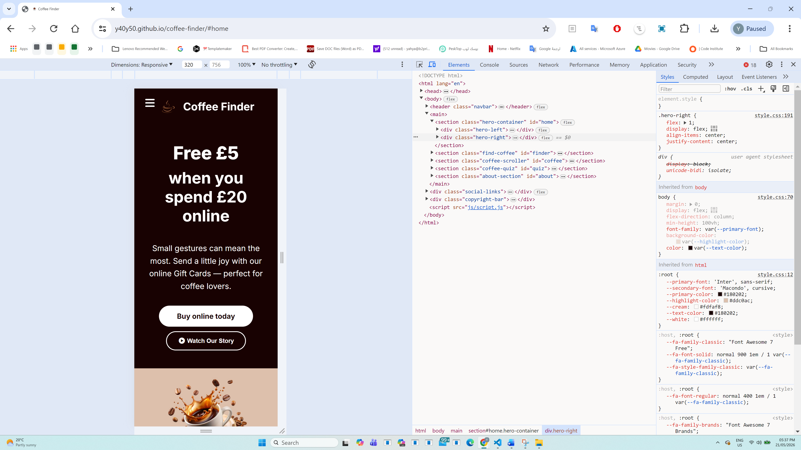
---

### User Story 7 – Tablet Responsive Layout
As a user I want the website to display properly on tablet devices.

#### Evidence
The website remains responsive on tablet screen sizes with properly aligned sections, responsive navigation, and accessible content spacing.

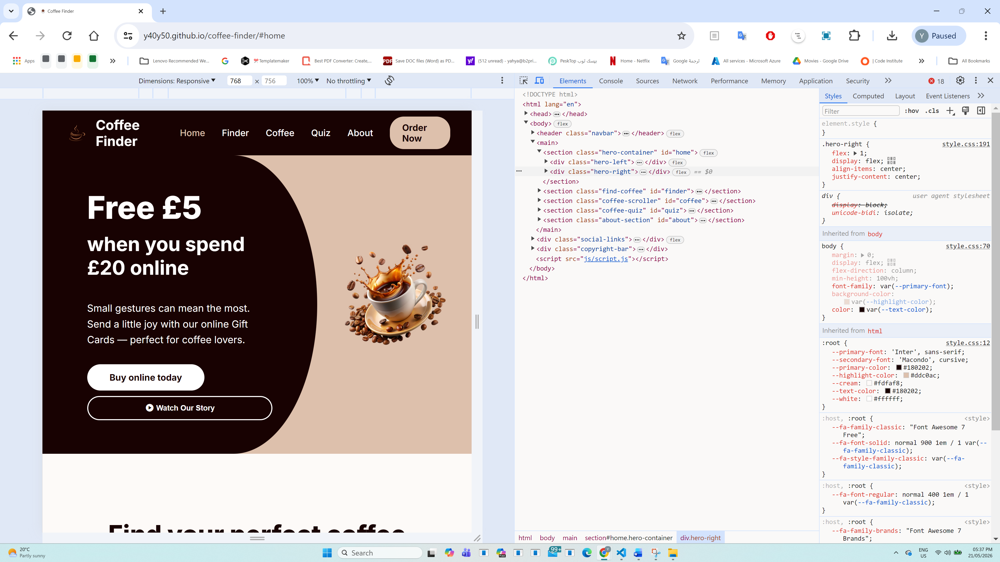

## Validation

* HTML validated using W3C Validator  

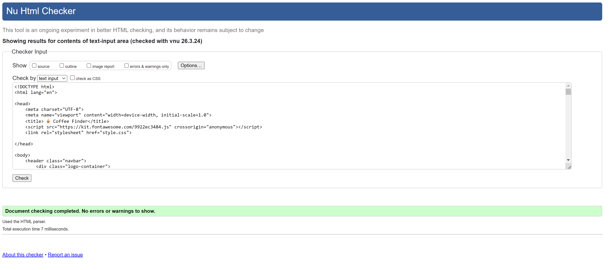

* CSS validated using W3C Validator  

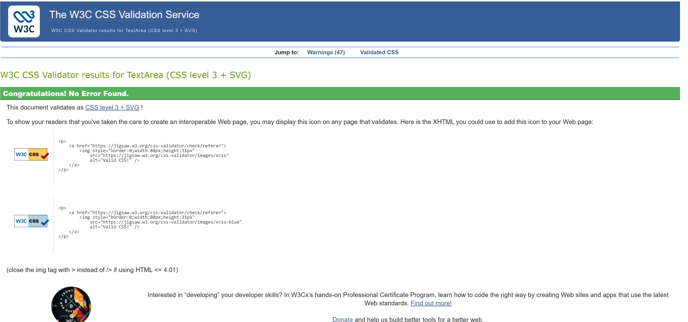

* JavaScript validated using JSLint  

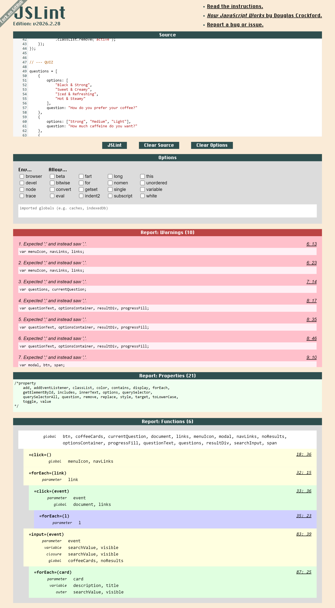

---

## Deployment Testing

After deployment using GitHub Pages, the deployed website was tested to ensure it matched the local development version.

The following features were tested after deployment:
- navigation links
- responsive layout
- quiz functionality
- search functionality
- images and media
- button interactions

No major differences were identified between the deployed version and the development version of the website.

--- 

## Bugs Found and Fixed

* Quiz not responding initially → Fixed by correcting event listener
* Image not loading → Fixed file path
* Styling inconsistency → Unified CSS classes

---

## Deployment

This project was deployed using GitHub Pages.

[GitHub live link](https://y40y50.github.io/coffee-finder/)

Steps:

1. Push project to GitHub
2. Go to repository settings
3. Enable GitHub Pages
4. Select main branch
5. Site is live

---

## Version Control

Git and GitHub were used throughout the development process to manage the project and track changes over time.

Regular commits were made during development to document feature additions, bug fixes, UI improvements, and README updates.

Examples of commits include:

* Initial project setup
* Added quiz functionality
* Improved search bar
* Added validation screenshots
* Improved README testing documentation
* Fixed bugs and improved UI

The commit history demonstrates continuous development rather than uploading the entire project at the end.
---

## File Structure

```text
assets/
├── css/ → Stylesheets
├── js/ → JavaScript functionality
├── images/ → Website images and media
├── docs/ → Testing screenshots and evidence

index.html → Main HTML page
```

## Credits

Some guidance and tutorials were referenced during development and have been credited within the code comments.

---

## Interactive Features Evidence

### 1. Coffee Recommendation Quiz
#### User Story:
    As a user, I want to answer a quiz so that I can get a coffee recommendation based on my preferences.

#### Evidence:
The quiz allows users to select options such as "Black & Strong" or "Sweet & Creamy"
JavaScript function checkChoice() processes user input and displays results
The result is shown dynamically on the page without reloading

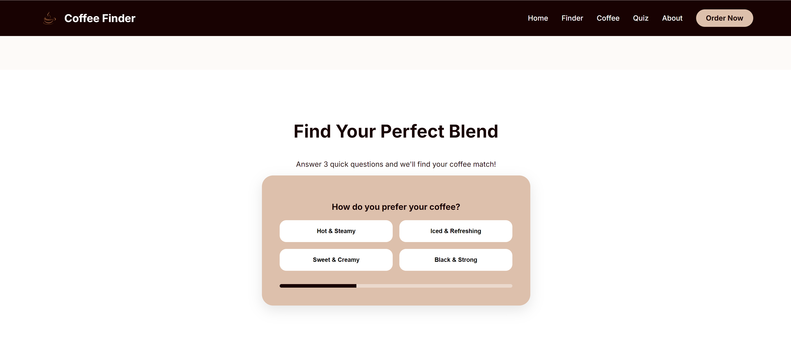

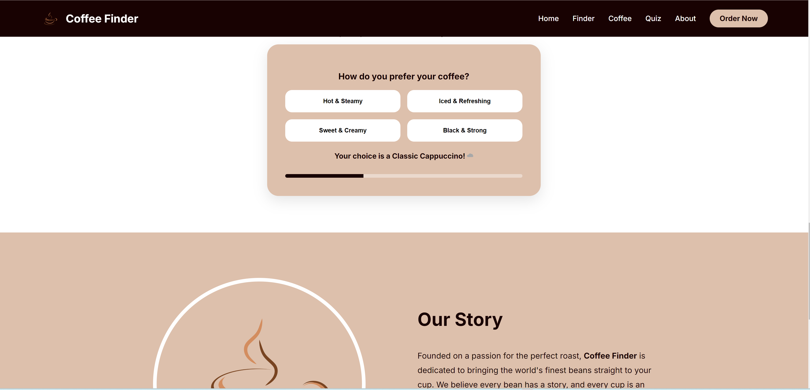

### 2. Responsive Navigation Menu

#### User Story:
As a mobile user, I want a navigation menu that I can open and close so that I can easily access different sections.

#### Evidence:

Hamburger menu icon toggles navigation links
JavaScript event listener adds/removes .active class
Menu icon changes from ☰ to X for better UX

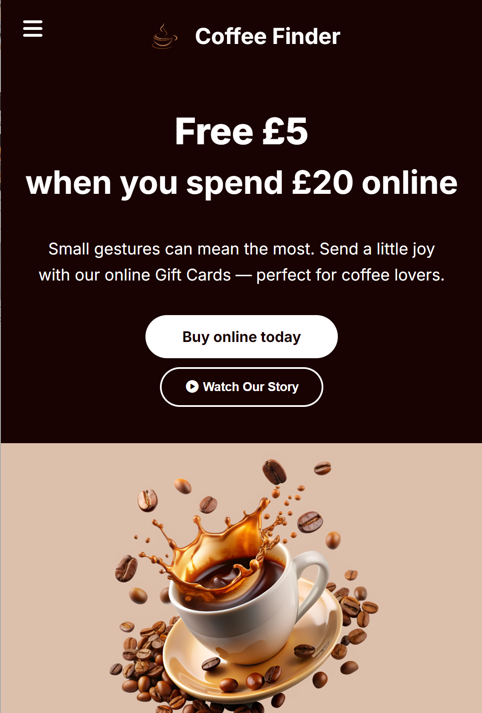

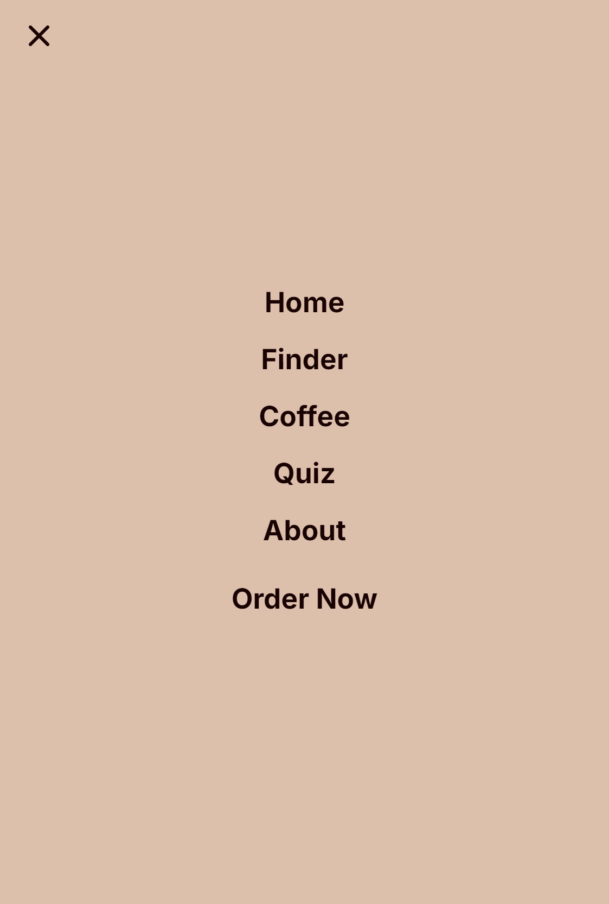

### 3. Interactive Video Modal

#### User Story:
As a user, I want to watch a video in a popup so that I can learn more without leaving the page.

#### Evidence:

Modal opens when "Watch Video" button is clicked
Modal closes when clicking X or outside the modal
Implemented using JavaScript and CSS modal logic

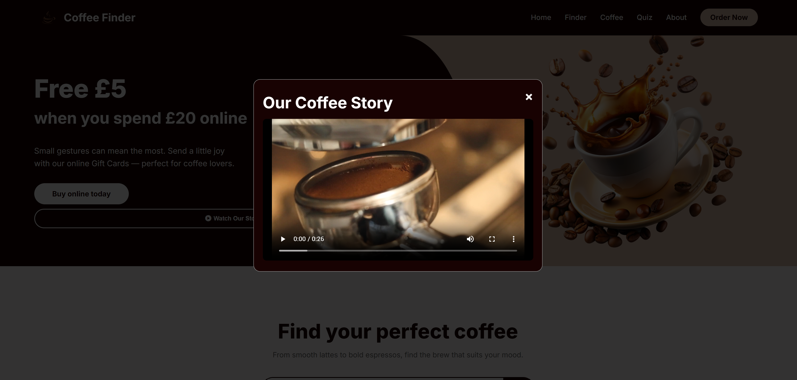

### 4. Visual Feedback with Progress Bar

#### User Story:
As a user, I want visual feedback when I interact with the quiz so that I understand my progress.

#### Evidence:

Progress bar fills when a selection is made
Updated dynamically using JavaScript (progressFill.style.width)

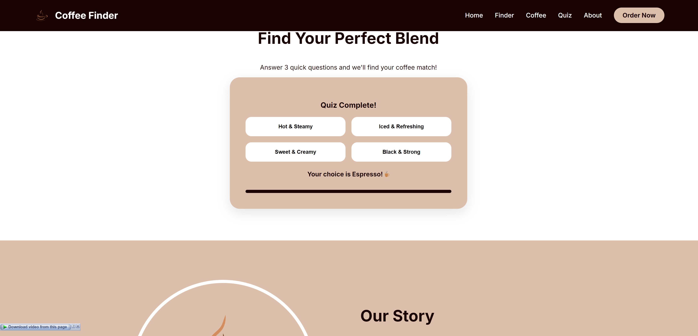


## Coffee Search with Feedback

### User Story

As a user, I want to search for a coffee and receive feedback if no results are found, so that I understand whether my search was successful.

---

### Evidence

    Typing "latte" shows only Latte
    Typing "espresso" shows Espresso
    Typing unrelated words shows "No coffee found"
    Clearing input restores all items

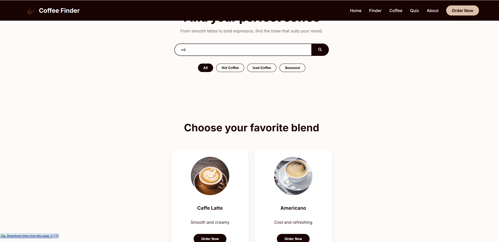

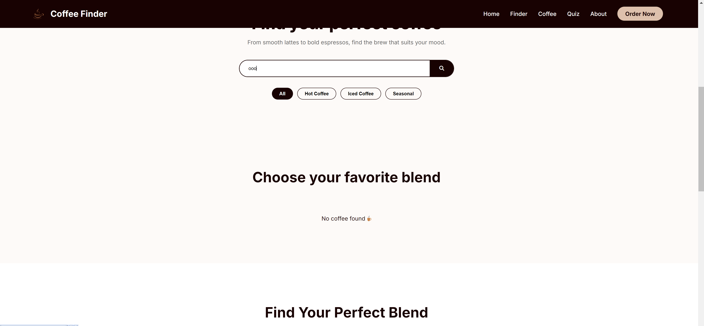

---

### Outcome

This improvement enhances usability by clearly informing users when no matching results are found, ensuring better interaction and meeting input validation requirements.


## 📌 Future Improvements

* Add category filter functionality (Hot / Iced / Seasonal)
* Improve quiz result logic for more accurate recommendations
* Add animations for better user experience
* Store user preferences (local storage)

---
